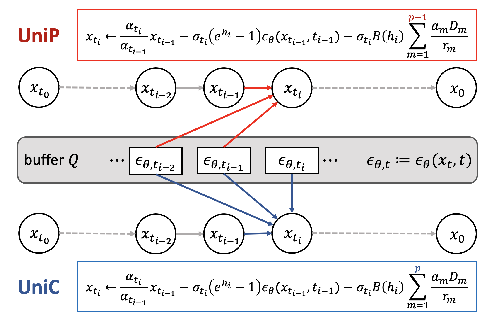
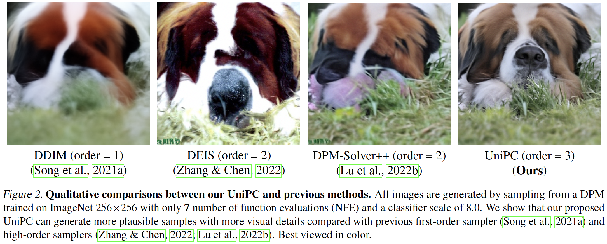

# UniPC: A Unified Predictor-Corrector Framework for Fast Sampling of Diffusion Models

Created by [Wenliang Zhao](https://wl-zhao.github.io/)\*, [Lujia Bai](https://lujia-bai.github.io)*, [Yongming Rao](https://raoyongming.github.io/), [Jie Zhou](https://scholar.google.com/citations?user=6a79aPwAAAAJ&hl=en&authuser=1), [Jiwen Lu](https://scholar.google.com/citations?user=TN8uDQoAAAAJ&hl=en&authuser=1)

This code contains the Pytorch implementation for UniPC (NeurIPS 2023).

---
An [online demo](https://huggingface.co/spaces/wl-zhao/unipc_sdm) for UniPC with stable-diffusion. Many thanks for the help and hardware resources supported by HuggingFace 🤗.

---

UniPC is a training-free framework designed for the fast sampling of diffusion models, which consists of a corrector (UniC) and a predictor (UniP) that share a unified analytical form and support arbitrary orders.

[[Project Page]](https://unipc.ivg-research.xyz/) [[arXiv]](https://arxiv.org/abs/2302.04867)

# News
- **2023.3.11**: UniPC is used in [stable-diffusion-webui](https://github.com/AUTOMATIC1111/stable-diffusion-webui).
- **2023.2.20**: UniPC is integrated into 🧨 Diffusers and accesible via the [UniPCMultistepScheduler](https://huggingface.co/docs/diffusers/main/en/api/schedulers/unipc).

---



UniPC is by designed model-agnostic, supporting pixel-space/latent-space DPMs on unconditional/conditional sampling. It can also be applied to both noise prediction model and data prediction model. 

Compared with previous methods, UniPC converges faster thanks to the increased order of accuracy. Both quantitative and qualitative results show UniPC can remarkably improve the sampling quality, especially in extreme few steps (5~10).



# Code Examples
We provide code examples based on the [ScoreSDE](https://github.com/yang-song/score_sde) and [Stable-Diffusion](https://github.com/CompVis/stable-diffusion) in the `example` folder. Please follow the `README.md` file in the corresponding examples for further instructions to use our UniPC.
## ScoreSDE with UniPC
We provide a pytorch example in `example/score_sde_pytorch`, where we show how to use our UniPC to sample from a DPM pre-trained on CIFAR10.

## Stable-Diffusion with UniPC

We provide an example of applying UniPC to stable-diffusion in `example/stable-diffusion`. Our UniPC can accelerate the sampling in both conditional and unconditional sampling.

## Integration with 🤗 Diffusers library

UniPC is now also available in 🧨 Diffusers and accesible via the [UniPCMultistepScheduler](https://huggingface.co/docs/diffusers/main/en/api/schedulers/unipc).
Diffusers allows you to test UniPC in PyTorch in just a couple lines of code.

You can install diffusers as follows:

```
pip install diffusers accelerate transformers
```

And then try out the model with just a couple lines of code:

```python
from diffusers import StableDiffusionPipeline, UniPCMultistepScheduler
import torch

path = "CompVis/stable-diffusion-v1-4"

pipe = StableDiffusionPipeline.from_pretrained(path, torch_dtype=torch.float16)

# change to UniPC scheduler
pipe.scheduler = UniPCMultistepScheduler.from_config(pipe.scheduler.config)
pipe = pipe.to("cuda")

prompt = "a highly realistic photo of green turtle"
generator = torch.manual_seed(0)

# only 15 steps are needed for good results => 2-4 seconds on GPU
image = pipe(prompt, generator=generator, num_inference_steps=15).images[0]

# save image
image.save("turtle.png")
```


For more information about UniPC and `diffusers`, please have a look [here](https://huggingface.co/docs/diffusers/main/en/api/schedulers/unipc) and [here](https://huggingface.co/docs/diffusers/main/en/using-diffusers/schedulers).

# Acknowledgement

Our code is based on [ScoreSDE](https://github.com/yang-song/score_sde), [Stable-Diffusion](https://github.com/CompVis/stable-diffusion), and [DPM-Solver](https://github.com/LuChengTHU/dpm-solver).

# Citation

If you find our work useful in your research, please consider citing:

```
@article{zhao2023unipc,
  title={UniPC: A Unified Predictor-Corrector Framework for Fast Sampling of Diffusion Models},
  author={Zhao, Wenliang and Bai, Lujia and Rao, Yongming and Zhou, Jie and Lu, Jiwen},
  journal={NeurIPS},
  year={2023}
}
```
